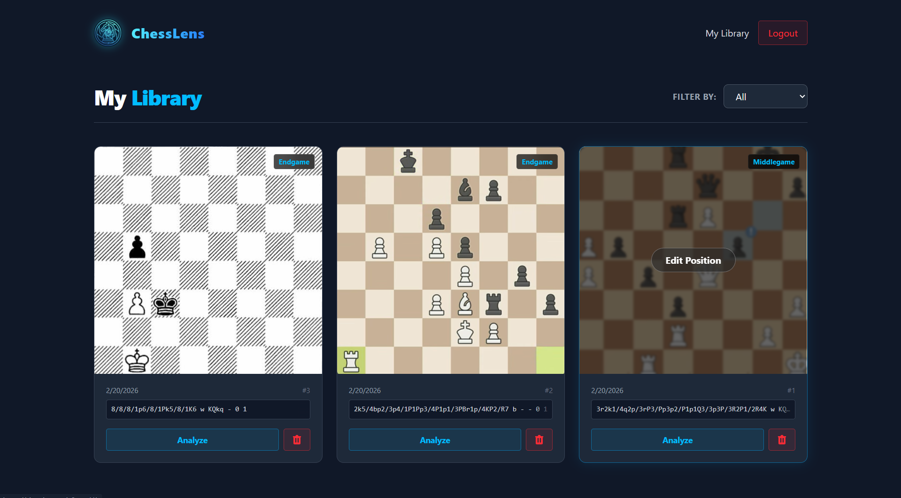
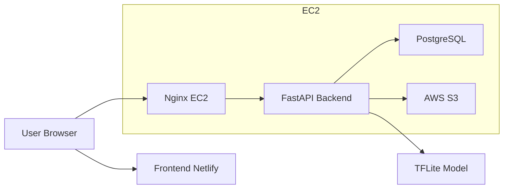

# ChessLens ♟️📸

**Turn digital chess boards into FEN notation using AI. No more setting up positions manually for analysis**



[](https://fastapi.tiangolo.com/)
[](https://react.dev/)
[](https://www.typescriptlang.org/)
[](https://tailwindcss.com/)
[](https://www.docker.com/)
[](https://www.postgresql.org/)
[](https://aws.amazon.com/)

---

## 🚀 Overview

**ChessLens** is a full-stack web application that uses a custom-trained **TensorFlow Lite** image classification model to convert **2D digital chessboard images** (such as screenshots from online games, chess apps, or digital diagrams) into **FEN (Forsyth–Edwards Notation)** strings.. Users drag-and-drop an image of a chess board, and the system extracts the exact position as **FEN (Forsyth–Edwards Notation)**, generates a Lichess analysis link, and saves the position to a personal library backed by cloud storage.

**Live Demo:** [https://chesslens.tech](https://chesslens.tech)
**API Docs:** [https://api.chesslens.tech/docs](https://api.chesslens.tech/docs)

---

## ✨ Features

- **AI Board Recognition** — Upload a photo of any chess board and receive the full FEN string in seconds, powered by a 13-class TFLite piece classifier that processes all 64 squares.
- **Instant Analysis** — Every prediction generates a direct [Lichess Board Editor](https://lichess.org/editor) link for immediate engine analysis.
- **Personal Library** — Authenticated users can save positions with categories (Tactics, Opening, Endgame, etc.), personal notes, and the original board image.
- **Cloud Image Storage** — Board images are uploaded to **AWS S3** and served via public URLs with per-user folder isolation.
- **Board Detail Editor** — Edit the FEN, toggle side-to-move, recategorize, and add notes from a dedicated detail page.
- **Drag & Drop Upload** — Built with `react-dropzone` for a smooth upload experience with live image preview.
- **JWT Authentication** — Secure register/login flow with bcrypt password hashing and OAuth2 Bearer tokens.


## 🧬 Architecture

### System Overview




### How the AI Pipeline Works

1. User uploads a JPEG/PNG image of a chess board.
2. The image is resized to **400×400** pixels and converted to grayscale.
3. The board is sliced into **64 individual 50×50 squares**.
4. Each square is classified by a **TensorFlow Lite** model into one of **13 classes** (empty, 6 white pieces, 6 black pieces).
5. Predictions are assembled rank-by-rank into a valid **FEN string**.
6. The FEN and a Lichess editor URL are returned to the client.

---

## 🛠️ Tech Stack

### Frontend

| Concern | Technology |
|---------|-----------|
| Framework | React 19 + TypeScript (Vite 7) |
| Styling | Tailwind CSS 4 |
| Routing | React Router v7 |
| HTTP Client | Axios (centralized instance with JWT interceptor) |
| File Upload | react-dropzone |
| Deployment | Netlify (SPA `_redirects` for client-side routing) |

### Backend

| Concern | Technology |
|---------|-----------|
| Framework | FastAPI (Python 3.10) |
| Database | PostgreSQL 16 (async via AsyncPG + SQLAlchemy) |
| Migrations | Alembic |
| Auth | OAuth2 + JWT (python-jose, passlib/bcrypt) |
| ML Inference | TensorFlow Lite, OpenCV, Pillow |
| Object Storage | AWS S3 (boto3) |
| Validation | Pydantic v2 + pydantic-settings |
| Server | Uvicorn (ASGI) |

### DevOps & Infrastructure

| Concern | Technology |
|---------|-----------|
| Containerization | Docker & Docker Compose |
| Reverse Proxy | Nginx |
| Cloud | AWS EC2 (Ubuntu) |
| SSL | Certbot / Let's Encrypt |
| CI/CD | Netlify (frontend), manual Docker deploy (backend) |

---

## 📁 Project Structure

```
chesslens/
├── docker-compose.yml          # Orchestrates PostgreSQL + Backend containers
├── backend/
│   ├── main.py                 # FastAPI app, CORS, lifespan
│   ├── config.py               # Pydantic Settings (env vars)
│   ├── database.py             # Async SQLAlchemy engine & session
│   ├── models.py               # User & Position ORM models
│   ├── schemas.py              # Pydantic request/response schemas
│   ├── auth.py                 # JWT creation, password hashing, get_current_user
│   ├── Dockerfile              
│   ├── requirements.txt
│   ├── alembic/                # Database migration scripts
│   ├── ml/
│   │   ├── predictor.py        # ChessPredictor class (TFLite inference)
│   │   └── piece_classifier_model.tflite
│   └── routers/
│       ├── auth.py             # POST /register, /login
│       ├── predict.py          # POST /ai/predict (image → FEN)
│       ├── fen.py              # Upload to S3, library CRUD
│       └── positions.py        # Position CRUD (category, notes)
└── frontend/
    ├── package.json
    ├── vite.config.ts
    ├── public/_redirects        # Netlify SPA routing
    └── src/
        ├── App.tsx              # Route definitions
        ├── components/
        │   ├── Navbar.tsx       # Logo, nav links, auth state
        │   ├── Layout.tsx       # Shared shell (Navbar + Outlet)
        │   ├── AuthGuard.tsx    # Protected route wrapper
        │   └── ChessboardDropzone.tsx  # Drag-and-drop image upload
        ├── pages/
        │   ├── Home.tsx         # Upload + analyze flow
        │   ├── Login.tsx        # Sign in form
        │   ├── Register.tsx     # Sign up form
        │   ├── Library.tsx      # Saved positions grid with category filter
        │   └── BoardDetails.tsx # Edit FEN, category, notes, side-to-move
        └── services/
            └── api.ts           # Axios instance, all API calls
```

---

## 📖 API Endpoints

All backend routes are prefixed with `/api`. Interactive Swagger docs are available at [https://api.chesslens.tech/docs](https://api.chesslens.tech/docs).


### Authentication — `/api/auth`

| Method | Endpoint | Description |
|--------|----------|-------------|
| `POST` | `/register` | Create a new user account |
| `POST` | `/login` | Authenticate and receive a JWT access token |

### AI Prediction — `/api/ai`

| Method | Endpoint | Auth | Description |
|--------|----------|------|-------------|
| `POST` | `/predict` | No | Upload a board image, receive FEN + Lichess URL |

### Library (Image + S3) — `/api/fen`

| Method | Endpoint | Auth | Description |
|--------|----------|------|-------------|
| `POST` | `/upload` | Yes | Upload image to S3 and save position |
| `GET` | `/library` | Yes | List all saved boards (newest first) |
| `GET` | `/library/{id}` | Yes | Get a single board's details |
| `PATCH` | `/library/{id}` | Yes | Update FEN, category, or notes |
| `DELETE` | `/library/{id}` | Yes | Delete board from S3 and database |

### Positions (CRUD) — `/api/positions`

| Method | Endpoint | Auth | Description |
|--------|----------|------|-------------|
| `POST` | `/` | Yes | Create a new position |
| `GET` | `/` | Yes | List positions (optional `?category=` filter) |
| `PATCH` | `/{id}` | Yes | Update a position |
| `DELETE` | `/{id}` | Yes | Delete a position |

---

## ⚡ Getting Started (Local Development)

### Prerequisites

- **Node.js** v18+
- **Python** 3.10+
- **Docker & Docker Compose**

### 1. Clone the Repository

```bash
git clone https://github.com/NuranR/chesslens.git
cd chesslens
```

### 2. Environment Variables

Copy the example file and fill in your own values: 
```
bash cp .env.example .env
```

### 3. Start the Backend (Docker)

This spins up both the **PostgreSQL 16** database and the **FastAPI** backend:

```bash
docker compose up -d --build
```

The API will be available at **http://localhost:8000** and Swagger docs at **http://localhost:8000/docs**.

### 4. Run Database Migrations

```bash
docker exec -it chesslens_backend alembic upgrade head
```

### 5. Start the Frontend

```bash
cd frontend
npm install
npm run dev
```

Visit **http://localhost:5173** to use the app.

---

## 🔮 Roadmap

- Automatic board detection for uncropped images (prerequisite for mobile support)
- Real-time analysis using Stockfish WASM in the browser 
- Mobile app for on-the-go position capture 
- Batch upload and analysis of multiple board images 
- Managed database and storage for improved scalability

---


## 🤝 Contributing

Contributions are welcome! If you find a bug or have a feature idea, please open an issue first.

---

## 📄 License

Distributed under the MIT License. See `LICENSE` for more information.

---

Built with ☕ and Python by **Nuran Ranawaka**
